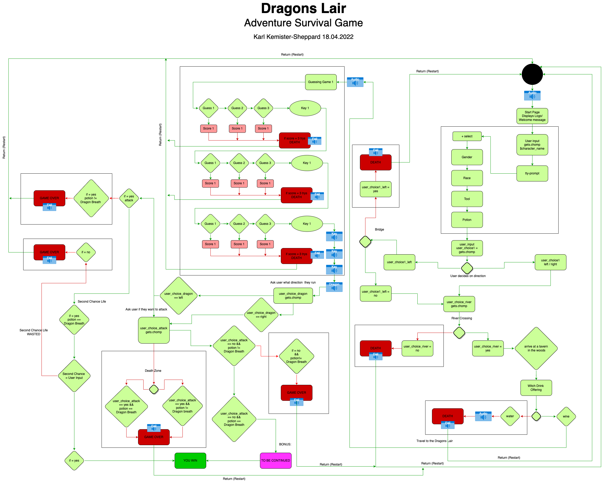
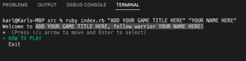

# T1A3_Terminal_App

### Source Control Repository
Below is a link to the first source control repository that was created before the Slide Deck presentation.
From there, I created a second branch called modularize and pushed all further updates to ensure that I had a backup copy of the working application before modularizing the index.rb by transferring the majority of the index code to defined methods.
### First Repo- prior to presentations (24 commits)
https://github.com/karlkemistersheppard/Terminal_App/tree/main
### Final Destination (42 commits +) 
Marking for the assessment to be done on this file. (Once marking is completed I will merge the branch into the main)
https://github.com/karlkemistersheppard/Terminal_App/tree/modulairze


### Code Styling

#### R5- Identify any code style guide or styling conventions that the application will adhere to.

Code styling for the Terminal Application is designed to be simplistic, clean and easy to read.
The general styling is based on each code block or method to be wrapped in a #HEADING and followed by a trailing #END to ensure whoever is reading the syntax can identify when a method is called.

All code blocks are invoked from external .rb files either using $global variable/values or wrapped in def methods to ensure that the main index.rb file is kept as clean as possible.
The styling convention of the index.rb file is laid out from top to bottom following the same flow in the methods.rb file.  Each method is labelled with meaningful titles to ensure that it’s easy to read and follow.

There are a few code blocks that are exempt from this styling, specifically the tty-progress bar that even though it works without issues- when wrapped inside a def method causes the progress bar to print a random value to the screen but displays no error.

Additional styling that was added later on in the development of the application was the conversion from standard STDIN.gets.chomp user input to TTY-Prompt to simplify the UX and Error Handling issues associated with incorrect user input.

##### Example 
Below is an example of how the index.rb file is styled.
As discussed above each method is called from the method.rb file and wrapped with a meaningful title then closed with a #END.
In addition to keeping it clean, I’ve used additional system "clear" syntax commands to clear the screen to ensure it’s easier for the user to read.
puts "\n" where also used throughout the methods and index.rb to space out the content for UX.

```ruby
#HOW TO PLAY TTY-PROMPT
puts tty_prompt_instructions
#END

system "clear"

#LOGO AND INTRO MUSIC
$process_id = spawn "afplay -v 0.2 It_Is_Coming_-_David_Fesliyan.mp3" 
puts "\n""\n""\n"                                         
puts $dragon_lair_logo
#END

# CREATE CUSTOM CHARACTER NAME
puts create_character_name
$character_name = $character_name.magenta
#END

#INTRO MESSAGE + STRING INTERPOLATION & USE OF $GLOBAL VARIABLE
system "clear"
puts "Welcome #{$character_name}, you are about to embark on a mystical journey to slay a fire breathing " + $dragon + "but before we get started, we need to build you a character"
puts "\n"
puts "\n"
#END

#TTY PROMPT CHARACTER
puts gender_selction
system "clear"
puts race_selection
system "clear"
puts tool_selection
system "clear"
puts potion_selection
#END
```
##### Example 
Styling conventions transfer across to the method.rb file and additional files to ensure its consistency for the viewers.

```ruby
#CREATE CHARACTER NAME
def create_character_name
    puts "So I can tell your fellow citizens about your adventure, please enter a unique character name." + " Be Creative".green
    $character_name = ""
    while true
        puts "Please enter your characters name?"
        $character_name = STDIN.gets.chomp.magenta
        $character_name.empty? ? (puts "Character name required") : break
    end
end
#END

#CHARACTER CREATION MENUS
def gender_selction
    require "tty-prompt"
    $prompt = TTY::Prompt.new
    choice = %w(Male Female)
    $gender = $prompt.select("Select your characters gender #{$character_name}", choice)
end
def race_selection
    require "tty-prompt"
    $prompt = TTY::Prompt.new
    choice = %w(Witcher Orc Human Blood-Elvf Night-Crawler Goblin Warthog Soul-Reaper Spartan Iron-Dwarf Kree-Warrior )
    $race = $prompt.select("Select your characters race #{$character_name}", choice)
end
def tool_selection
    require "tty-prompt"
    $prompt = TTY::Prompt.new
    choice = %w(Infinity-Gauntlet Darkhold-Blade Mjolnir Gold-Fist Liquid-Sword Nothing)
    $tool = $prompt.select("Select your characters weapon #{$character_name}", choice)
end
def potion_selection
    require "tty-prompt"
    $prompt = TTY::Prompt.new
    choice = %w(Wolf-Blood Vital-Essence Oort-Brew Soul-Dealer Dragon-Breath)
    $potion = $prompt.select("Select your characters potion #{$character_name}", choice)
end
#END

#INTRO TO STORY
def intro_story
    puts "#{$character_name} can you hear me....." + "whispers".italic + " my name is #{$book_reader.yellow}, I am here to help you on your adventure...lets head to the edge of town to start our journey."
    sleep(4)
    puts "Fearless #{$race} you have arrived at your first destination, you are standing In front of Blood Moons Forest and tonight the moon is alive #{$moon}" 
    sleep(3)
    puts "The trees are talking, and you try to forget about the myths you have heard......"
    sleep(2)
    puts "\n"
    puts "#{$book_reader.yellow}" + " whispers anyone that has entered the forest has never been seen again".italic
    puts "\n"
    puts "\n"
    sleep(3)
    puts "You now have to decide which direction you want to take? "
end
#END
```

### Features
R6	Develop a list of features that will be included in the application. It must include:
  
### Feature 1 (Control Structures) 

The below code block is taken from one of the riddles that were implemented into the adventure game to test the users.
The control structure for this particular block consists of a large variety of:
##### While loops & if else statements

In the below feature, I used if and else conditions to check the condition using logical operators to determine if the program needs to iterate through the while loop until the count_limit reaches (3) or until the user_guess is == correct _answer.  Once the  user_guess is == to the correct_answer the while loop will exit the loop and move to the next if conditional statement executing the elsif condition and print “Well done” to the user.

```ruby
  while user_guess != correct_answer and !out_of_guesses 
        if current_count < count_limit 
        puts "Guess: "
        user_guess = STDIN.gets.chomp()
        current_count += 1

        else
        out_of_guesses = true
        end
    end
```
##### Variables

Variables were used to save strings, integers and boolean expressions ect:  false, 3, 0 “dragon”.
This was vital for the guessing game to function as without them the while loops, and if statements would not be able to compare the current user_guess or guess_count to decide if the user had passed or failed the riddle.

```ruby
correct_answer = "dragon"
    user_guess = ""
    current_count = 0
    count_limit = 3
    out_of_guesses = false
```
##### Boolean expressions

Great use of the boolean expression false is utilising it inside an if statement as below.  
If out of guesses is false do the below.  This helps direct the program to execute particular commands based on the outcome/value returned.

```ruby
if out_of_guesses
        puts "You are out of guesses, the floor just opened up and you fell to your death #{$death_emoji}"
        sleep(4)
        system "clear"
        Process.kill("SIGKILL", $process_id)
        puts $try_again
        $process_id = spawn "afplay -v 0.2 fail_effect.mp3"
        # system("killall afplay")
        begin
            exit!
        rescue SystemExit
            p 123
        end 
        return
```
##### Error Handling

I've added the below to each endpoint in the user's journey to ensure that the program exits/terminates after the TRY AGAIN prompt is displayed.
```ruby
        begin
            exit!
        rescue SystemExit
            p 123
        end 
        return
```
##### Logical operators

There was only one requirement for using logical operators in this code block and that was used ot check the two conditions ect while user_guess is not = correct_answer (and, &&) user is !not outs_of_guesses do this.
```ruby
    while user_guess != correct_answer and !out_of_guesses
        if current_count < count_limit
        puts "Guess: "
        user_guess = STDIN.gets.chomp()
        current_count += 1

        else
        out_of_guesses = true 
        end
    end
```

#### Feature 2 (Tty-Prompt)

I decided to incorporate the TTY-Prompt (ruby gem) into my program to reduce the risk of error handling occurring from the user incorrectly entering invalid options using a gets.chomp scenario or simply running exit and avoiding the creation in the beginning. 

Moving the tty-prompt to the individual methods allowed for more control from the development side as it handles the majority of the possible errors.
Below example of the main character selection

```ruby
#CHARACTER CREATION MENUS
def gender_selction
    require "tty-prompt"
    $prompt = TTY::Prompt.new
    choice = %w(Male Female)
    $gender = $prompt.select("Select your characters gender #{$character_name}", choice)
end
def race_selection
    require "tty-prompt"
    $prompt = TTY::Prompt.new
    choice = %w(Witcher Orc Human Blood-Elvf Night-Crawler Goblin Warthog Soul-Reaper Spartan Iron-Dwarf Kree-Warrior )
    $race = $prompt.select("Select your characters race #{$character_name}", choice)
end
def tool_selection
    require "tty-prompt"
    $prompt = TTY::Prompt.new
    choice = %w(Infinity-Gauntlet Darkhold-Blade Mjolnir Gold-Fist Liquid-Sword Nothing)
    $tool = $prompt.select("Select your characters weapon #{$character_name}", choice)
end
def potion_selection
    require "tty-prompt"
    $prompt = TTY::Prompt.new
    choice = %w(Wolf-Blood Vital-Essence Oort-Brew Soul-Dealer Dragon-Breath)
    $potion = $prompt.select("Select your characters potion #{$character_name}", choice)
end
#END
```
##### String Interpolation

Demonstration of basic string interpolation as used inside the tty-prompt message to the user.
As the string variable was created external to the method, the variable was converted into a global variable for the function to work.  
```ruby
$potion = $prompt.select("Select your characters potion #{$character_name}", choice)
```
##### Variables

In the code block, I saved three separate variables two of which I converted to $global variables so I could use them in other areas of the program external to the method.
Using $global variables was an important style/structure for the development of this application, due to the complexity and range of paths the user can take to run the adventure.

```ruby
def potion_selection
    require "tty-prompt"
    $prompt = TTY::Prompt.new
    choice = %w(Wolf-Blood Vital-Essence Oort-Brew Soul-Dealer Dragon-Breath)
    $potion = $prompt.select("Select your characters potion #{$character_name}", choice)
end
```

##### Error Handling

Error handling for the TTY-Prompt is dealt with by the Development team that created and maintain the Gem.
It forces the user to select from a list of items presented on the display and in this case it provides no option to exit or bypass the prompt.select.

```ruby
def potion_selection
    require "tty-prompt"
    $prompt = TTY::Prompt.new
    choice = %w(Wolf-Blood Vital-Essence Oort-Brew Soul-Dealer Dragon-Breath)
    $potion = $prompt.select("Select your characters potion #{$character_name}", choice)
end
```
##### Logical operators

Below is a snippet from a code block method that utilizes the TTY-Prompt.select $global variable to check it against the $users_choice_attack to pass a new direction for the player.
This is a powerful way to hide secret second chance options based on conditions created at the beginning of the program, for example, if the user selects $potion = "Dragons-Breath" and the user attacks the dragon, they would normally die but if both conditions below are true then the user can access the second chance life/option.

```ruby
#Second Chance Life BASED on Potion Selection.. LINE 465 Methods.rb
        elsif $user_choice_attack == "yes" && $potion == "Dragon-Breath"
            puts "You attempt to use the #{$tool} on the dragon but before you can do anything it blasts you with a fireball..... #{$death_emoji}"
            sleep(2)
            puts "But wait...."
            sleep(1)
            puts "You have survived the first blast"
            puts "The dragon steps back and is confused ........"
            sleep(3)
            puts "You can't believe your luck.... you are still alive"
            sleep(1)
            puts "How..... am i alive"
            puts "You realise that you have survived the first blast from the dragon due to the #{$potion} potion you selected at the beginning of your journey"
            puts "You now have to decide your fate as you realise that the potion is used its life."
            require "tty-prompt"
            $prompt = TTY::Prompt.new
            choice = %w(yes no)
            $second_chance = $prompt.select("Do you wish to ask for forgiveness from the dragon and offer your service #{$character_name}", choice)
        end
```
##### Error Handling

Error handling has not been required for this function as the user choices were predefined in the tty-prompt selector.
```ruby
choice = %w(yes no)
```

#### Feature 3 (Variables and Variable Scope)

My main reason for choosing this feature was the complexity of using multiple variables both internal the existing method and calling $global methods that were assigned to three separate.rb files in the program.  This was a great way to showcase my skill and understanding of variables in a shortcode block.

##### Importing from TTY-Progressbar & Colorize Gem 

Gemfile- added the below to and to initiate the gem I have added it the to top of the index.rb file so I can function correctly.
```ruby
gem "tty-progressbar", "~> 0.18.2"
```
Stardard gem syntax with the addition of string interpolation and colorize gem as added features to customise the progress bar where used in this instance.
```ruby
bar = TTY::ProgressBar.new("Preparing your Adventure #{$character_name} [:bar]".colorize(:blue), total: 45) # Added TTY Progress bar showing quiz is downloading for UX
45.times do
  sleep(0.1)
  bar.advance
end
```
##### Loops

TTY- Progress bar comes preloaded with a built-in loop that can be modified based on the multiplier count through which you want the progress bar to iterate through.
In this example, I have called the loop 45 times with a 0.1-second sleep() function to smoothen the transition between the loops.

```ruby
45.times do
  sleep(0.1)
  bar.advance
```
##### System Clear

Throughout the program I have utilized the system "clear", to clear the screen when the display information is no longer required so it assists with keeping the user’s viewport clean and uncluttered.

```ruby
system "clear"
```

##### Variables & Global Variables

The below function uses a mix of variables both local and global, but more importantly its using these variables from inside index.rb and calls them from other methods such as the TTY-Prompt character creation method.  This was an important function as I wanted to utilise string interpolation to make the puts statement meaningful to the user by printing what they had selected in the string.

An additional bonus feature was the inclusion of the emoji regex gem that allowed me to save Unicode emojis in the $global_unicode.rb to variables and call them by assigning them via string interpolation at any given time.

```ruby
#INCLUDES CALLING $GLOBAL VARIABLES AND GEM UNICODE + TTY-PROMPT PROGRESS BAR GEM
puts "Congratulations #{$character_name}, you are the first #{$gender} #{$race} to embank on such a dangerous journey, you have decided to grab #{$tool} as your weapon to protect youself and have a vial of #{$potion} #{$potion_emoji}"
puts "\n"
bar = TTY::ProgressBar.new("Preparing your Adventure #{$character_name} [:bar]".colorize(:blue), total: 45)
45.times do
  sleep(0.1)
  bar.advance
end
sleep(3)
system "clear"
#END
```

#### Feature Bonus (afplay)

This is a feature that i found on [Source](https://ss64.com/osx/afplay.html) the documentation is extremely limited, but it connects to the Kernel System and begins the process without waiting for any processes to finish.  This is a great way to spawn audio files into a .rb file if you’re trying to draw the player into your world in this case, Dragons Lair.

The **function** is broken up into three stages.

Stage one is creating the link with the system.
This is the basic syntax for calling the function which saves the file into a global variable called $process_id.  
Once the process executes it spawns the afplay connection to initiate the audio feed => from here you can control the audio volume to the feed with -v 0.2 "This is adjustable from **0.01 - 255"** worth noting **-v 50** will cause potential damage to your speakers.
Once the -v control is set you can simply input the audio file name followed by the audio format and ensure you point it to the correct directory path.
```ruby
$process_id = spawn "afplay -v 0.2 It_Is_Coming_-_David_Fesliyan.mp3" 
```
Stage two is only needed if you wish to kill the function midstream,  this may be useful if you need the sound to be interrupted at any stage during the program. I used this process multiple times across the program when I needed to kill the process either when the game ended or the player failed.  One of the great features of using afplay is that you can overlap audio files such as what I’ve done within this program. 

I set It_Is_Coming_-_David_Fesliyan.mp3 to -v 0.2 to set the background noise whilst running  -v 1 Walking_into_Dungeon.mp3 over the background music.
```ruby
Process.kill("SIGKILL", $process_id)
```
The final stage is the system overriding Kill all “afplay” commands, this will terminate every sound command afplay is currently handling once it’s called.
This is used in some instances throughout the program and the end points to ensure the sound doesn’t continue to play passed the termination of the Terminal application as it’s not running the function in the Terminal but rather throughout the main system kernel.
```ruby
system("killall afplay")
```

### Development Planning

#### Trello Board
https://trello.com/b/oZLNoiP9/t1a3-terminal-app-kks

R7	Develop an implementation plan which:

#### Feature 1 (Estimated Time Allocation 6-7h hrs)

##### Checklist

1. Create def method called riddles **DONE**
2. Create variables and assign their values **DONE**
3. Create While Loop to compare while user_guess input is != (not equal) to correct_answer && user is !(not) out_of_guesses. **DONE**
4. Create a conditional loop that checks if current_count is less than count_limit which then needs to take the current_count and increment it by +1 until user_count is equal to (3) **DONE**
5. Create else condition that checks if the out_of_guesses is = to true, which is then needed to run the next conditional check. **DONE**
6. Create a new condition to check if the user is out_of_guesses then puts a message on the screen and terminate the game. **DONE**
7. Add Audio kill feature **DONE**
8. Puts Global variable $try_again to screen. **DONE**
9. Added begin/rescue to run SystemExit. **DONE**
10. Add elsif if the new condition is not true- then puts message to the screen "Well Done" if the user guesses correct_answer. **DONE**

#### Feature 2 (Estimated Time Allocation ? hrs)

##### Checklist

1. Create a method to contain each tty-prompt. **DONE**
2. Initiate the tty-prompt with require. **DONE**
3. Create a local variable called choice and add in objects to create the list the user selects from ect (Male Female). **DONE**
4. Create $Global variable for that will hold the user's selection from the list selector. **DONE**
5. Use string interpolation to add $character_name into the string to make the puts message more personal. **DONE**
6. Use the $variable created externally in the game when required. **DONE**
7. Test functions, and ensure Errors are not present. **DONE**

#### Feature 3 (Estimated Time Allocation 1-2 hrs)

##### Checklist

1. Install tty-progress gem and link to .rb file containing gem. **DONE**
2. Copy Gem syntax from GitRepo Documents. **DONE**
3. Modify puts message that will be displayed inside the progress bar when it's active. **DONE**
4. Add $character_name into the puts message using string interpolation. **DONE**
5. Initialize colorize ruby gem to change the color of the bar. **DONE**
6. Update iteration loop to 45 for time delay for UX. **DONE**
7. Update bar print advance to 45 so it prints ========= to the screen. **DONE**
8. Add system "clear". **DONE**

##### Development Process




##### Development Process Trello


### Help Documentation

#### How to play

To initiate the game from the Terminal once you have followed the install process.
Navigate inside the src directory via the command line/ terminal and enter the below to run the game.
```code
./run_index.rb
```
You will be greeted with the below option 
```code
1. Step one you already made it here
2. Set two create your custom name you would like to use for your character " + "BE CREATIVE".green + "
3. Step three create your character from the options provided
4. Step four adjust your sound
5. Step five read the story and try to navigate your way to the exit without dying
6. Step six if you fail, try again until you reach the end game         
7. Have fun along the way... I hope you enjoy the adventure as much as i did create it
8. Now go find that
```


#### Instalation Instructions

R8	Design help documentation which includes a set of instructions which accurately describe how to use and install the application.

##### How to install

**Before** you get started, I want to say thank you for downloading my first ever Terminal Application I have ever created.
I hope you enjoy it as much as I did making it.

1. **Install ruby** [Install Ruby HERE](https://www.ruby-lang.org/en/documentation/installation/)
2. **Install Git** to your local machine so you can clone repo from Github [Install Git HERE](https://git-scm.com/downloads)
3. 3. Once you have Installed Step (1,2) **Clone** the below repo to your local machine [Download Repo from HERE](git@github.com:karlkemistersheppard/Terminal_App.git)
   ```code
   git@github.com:karlkemistersheppard/Terminal_App.git
   ```
4. **Open** your Terminal
5. **Navigate** to the src directory
6. **Run** the below once you are in the correct directory (check your sound volume before initiating)
   ```code
   ./run_index.sh
   ```
   Running the bash file will **install** the files contained in the Gemfile and run index.rb via the bash script.
   ```ruby
   #!/bin/bash

   #installing the bundler gem
   gem install bundler
   #installing the gems required for the application
   bundle install
   clear
   #runs the application
   ruby index.rb "Dragons Lair" "KARL" #Command line ARGV is available my modifying these two strings
    ```

7. Bundler will **install** the following Ruby Gems and their dependencies. 

##### frozen_string_literal: true

```ruby
   source "https://rubygems.org"
```
##### gem "rails"
   
```ruby
   gem "colorize", "~> 0.8.1"
   gem "tty-prompt", "~> 0.23.1"
   gem "tty-progressbar", "~> 0.18.2"
   gem 'emoji_regex'
```
8. If you wish to **modify** the command line **ARGV** (arguments) when you run the program you can change the two arguments by typing in the below.
   ```ruby
   ruby index.rb "ADD YOUR GAME TITLE" "ADD YOUR NAME HERE"
    ``` 


9. HAVE FUN PLAYING :)


## Reference list

262588213843476 (n.d.). Ruby CLI Audio Player example using afplay. [online] Gist. Available at: https://gist.github.com/ihollander/61b194622b7a5389a581ed2a270d0641 [Accessed 23 Apr. 2022].

Castello, J. (2019a). How to Tell Your Ruby Program to Stop Running Early. [online] RubyGuides. Available at: https://www.rubyguides.com/2019/03/ruby-exit/ [Accessed 20 Apr. 2022].

Castello, J. (2019b). Understanding Variable Scope & Binding Objects in Ruby. [online] RubyGuides. Available at: https://www.rubyguides.com/2019/03/ruby-scope-binding/ [Accessed 22 Apr. 2022].

Emojipedia.org. (2019). Emojipedia — Home of Emoji Meanings. [online] Available at: https://emojipedia.org/ [Accessed 15 Apr. 2022].

Kalbarczyk, M. (2009). colorize | RubyGems.org | your community gem host. [online] rubygems.org. Available at: https://rubygems.org/gems/colorize/versions/0.8.1.

Murach, P. (2014). tty-progressbar | RubyGems.org | your community gem host. [online] rubygems.org. Available at: https://rubygems.org/gems/tty-progressbar [Accessed 23 Apr. 2022].

Murach, P. (2015). tty-prompt | RubyGems.org | your community gem host. [online] rubygems.org. Available at: https://rubygems.org/gems/tty-prompt [Accessed 23 Apr. 2022].

NanoDano (2019). Enhanced Shell Scripting with Ruby. [online] DevDungeon. Available at: https://www.devdungeon.com/content/enhanced-shell-scripting-ruby#toc-16 [Accessed 21 Apr. 2022].

patorjk (n.d.). Text to ASCII Art Generator (TAAG). [online] patorjk.com. Available at: http://patorjk.com/software/taag/#p=testall&f=3D%20Diagonal&t=D%20R%20A%20G%20O%20N%20S%0A%20%20L%20A%20I%20R [Accessed 15 Apr. 2022].

quicksounds.com. (n.d.). Knife Fall On Metal Ground 2 Sound Effect MP3 Download Free - Quick Sounds. [online] Available at: https://quicksounds.com/sound/17708/knife-fall-on-metal-ground-2 [Accessed 16 Apr. 2022].

quicksounds.com. (n.d.). Sad Trombone Wah Wah Wah Fail Sound Effect MP3 Download Free - Quick Sounds. [online] Available at: https://quicksounds.com/sound/323/sad-trombone-wah-wah-wah-fail [Accessed 16 Apr. 2022].

quicksounds.com. (n.d.). Scary Witch Cackle Sound Effect MP3 Download Free - Quick Sounds. [online] Available at: https://quicksounds.com/sound/8839/scary-witch-cackle [Accessed 16 Apr. 2022].

Ruby Monsters (n.d.). Logical operators | Ruby for Beginners. [online] ruby-for-beginners.rubymonstas.org. Available at: http://ruby-for-beginners.rubymonstas.org/operators/logical.html [Accessed 21 Apr. 2022].

RubyGuides. (2018). Ruby Variables: How to Use Them & What Types Are Available. [online] Available at: https://www.rubyguides.com/ruby-tutorial/variables/ [Accessed 21 Apr. 2022].

Santa Clara University (2021). A Framework for Ethical Decision Making. [online] www.scu.edu. Available at: https://www.scu.edu/ethics/ethics-resources/a-framework-for-ethical-decision-making/ [Accessed 15 Apr. 2022].

Sheppard, S. (n.d.). afplay Man Page - macOS - SS64.com. [online] ss64.com. Available at: https://ss64.com/osx/afplay.html [Accessed 21 Apr. 2022].

Stack Overflow. (n.d.). markdown - How to add images to README.md on GitHub? [online] Available at: https://stackoverflow.com/questions/14494747/how-to-add-images-to-readme-md-on-github [Accessed 23 Apr. 2022].

Stokes, J. (2017). emoji_regex | RubyGems.org | your community gem host. [online] rubygems.org. Available at: https://rubygems.org/gems/emoji_regex [Accessed 23 Apr. 2022].

szabgab (2015). ARGV - the command line arguments of a Ruby program. [online] Code Maven. Available at: https://code-maven.com/argv-the-command-line-arguments-in-ruby [Accessed 23 Apr. 2022].

Unsplash (2022). Photo by Jonathan Kemper on Unsplash. [online] unsplash.com. Available at: https://unsplash.com/photos/zQMN9fLJehM?utm_source=unsplash&utm_medium=referral&utm_content=creditShareLink [Accessed 23 Apr. 2022].

wisecracker (2016). OSX afplay command line audio player _manual_. [online] www.unix.com. Available at: https://www.unix.com/os-x-apple-/267933-osx-afplay-command-line-audio-player-_manual_.html [Accessed 17 Apr. 2022].

www.fesliyanstudios.com. (n.d.). It Is Coming by David Fesliyan - Royalty Free Music Download. [online] Available at: https://www.fesliyanstudios.com/royalty-free-music/download/it-is-coming/262 [Accessed 15 Apr. 2022].

www.fesliyanstudios.com. (n.d.). Search Free Sound Effects | FesliyanStudios. [online] Available at: https://www.fesliyanstudios.com/sound-effects-search.php?q=unlock+lock [Accessed 15 Apr. 2022].